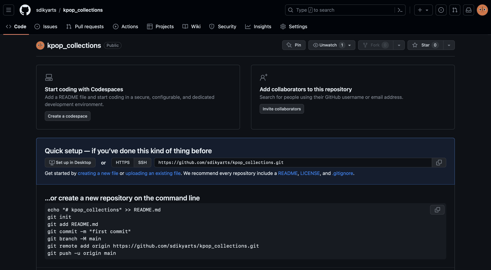

<h2>Data Mahasiswa</h2>
Nama    : Yasmine Putri Viryadhani
 
NPM     : 2206081862
 
Kelas   : PBP A
 
 

<h2>Deskripsi Tugas</h2>
Nama App            : K-Pop Collections
 
Link App Adaptable  :
 
Link Repository     : https://github.com/sdikyarts/kpop_collections.git
 
 

<h2>Checklist Tugas</h2>
<h3>Proses pengimplementasian Checklist Tugas:<h3>
<h4>1. Membuat proyek Django</h4>
<dl>
    <dt>* Inisiasi Direktori Lokal</dt>
        <dd>- Sebelum membuat proyek Django, dibuatlah sebuah direktori kosong baru di lokal. Saya menamainya sebagai <code>kpop_collections</code></dd>
        <dd>- Setelah membuat direktori, kita harus menginisiasi repositori Git kosong di direktori tersebut dengan perintah <code>git_init</code></dd>
        <dd>- Lalu, kita harus mengkonfigurasi username dan email GitHub ke repositori Git tersebut di Terminal (MacOS) dengan cara:</dd>
        <dl>
            <dt>
                    <dd><code>git config user.name "<NAME>"</code></dd>
                <dd><code>git config user.email "<EMAIL>"</code></dd>
            </dt>
        </dl>
        <dd>- Kita juga bisa mengkonfigurasi secara global dengan cara:</dd>
        <dl>
            <dt>
                <dd><code>git config --global user.name "<NAME>"</code></dd>
                <dd><code>git config --global user.email "<EMAIL>"</code></dd>
            </dt>
        </dl>
        <dd>- Verifikasi git lokal</dd>
        <dl>
            <dt>    
                    <dd><code>git config --list --local</code></dd>
            </dt>
        </dl>
    <dt>* Membuat repository baru di GitHub<dt>
        <dd>
            
        </dd>
    </dt>
    <dt>* Instalasi + Inisiasi Django pada repository</dt>
        <dd>- Menambahkan virtual environment ke dalam directory <code>kpop_collections</code> dengan menjalankan kode <code>python3 -m venv env</code> (di MacOS)</dd>
        <dd>- Menjalankan virtual environment dengan cara <code>source env/bin/activate</code></dd>
        <dd>- Menyiapkan Dependencies dengan membuat berkas <code>requirements.txt</code> di directory yang sama, lalu menambahkan
        <dl>
            <dt>
                <dd>
                    <pre>
                    <code>
                        django
                        gunicorn
                        whitenoise
                        psycopg2-binary
                        requests
                        urllib3
                    </code>
                    </pre>
                </dd>
            </dt>
        </dl>
        ke dalam berkas <code>requirements.txt</code></dd>
        <dd>- Install dependencies dengan menjalankan <code>pip install -r requirements.txt</code></dd>
        <dd>- Buat proyek Django dengan nama <code>kpop_collections</code> dengan menjalankan perintah <code>django-admin startproject kpop_collections .</code></dd>
        <dd>- Tambahkan <code>*</code> pada <code>ALLOWED HOSTS</code> di <code>settings.py</code></dd>
        <dl>
            <dt>
                <dd>
                <pre>
                    <code>
                        ...
                        ALLOWED_HOSTS = ["*"]
                        ...
                    </code>
                </pre>
                </dd>
            </dt>
        </dl>
        <dd>- Setelah memastikan file <code>manage.py</code> ada di directory, jalankan instruksi <code>./manage.py runserver</code> (MacOS). Saat menjalankan domain http://localhost:8000 muncul animasi roket</dd>
        <dd>
            
        </dd>
    <dt>* Push ke repository GitHub</dt>   
        <dd>- Buat file <code>.gitignore</code> (masih di directory <code>kpop_collections</code>), lalu isi dengan kode berikut</dd>
<pre><code class="python">
# Django
*.log
*.pot
*.pyc
__pycache__
db.sqlite3
media

<code># Backup files</code>
*.bak 

<code># If you are using PyCharm
# User-specific stuff
.idea/**/workspace.xml
.idea/**/tasks.xml
.idea/**/usage.statistics.xml
.idea/**/dictionaries
.idea/**/shelf</code>

<code># AWS User-specific</code>
.idea/**/aws.xml

<code># Generated files</code>
.idea/**/contentModel.xml

<code># Sensitive or high-churn files</code>
.idea/**/dataSources/
.idea/**/dataSources.ids
.idea/**/dataSources.local.xml
.idea/**/sqlDataSources.xml
.idea/**/dynamic.xml
.idea/**/uiDesigner.xml
.idea/**/dbnavigator.xml

<code># Gradle</code>
.idea/**/gradle.xml
.idea/**/libraries

<code># File-based project format</code>
*.iws

<code># IntelliJ</code>
out/

<code># JIRA plugin</code>
atlassian-ide-plugin.xml

<code># Python</code>
*.py[cod] 
*$py.class 

<code># Distribution / packaging </code>
.Python build/ 
develop-eggs/ 
dist/ 
downloads/ 
eggs/ 
.eggs/ 
lib/ 
lib64/ 
parts/ 
sdist/ 
var/ 
wheels/ 
*.egg-info/ 
.installed.cfg 
*.egg 
*.manifest 
*.spec 

<code># Installer logs</code>
pip-log.txt 
pip-delete-this-directory.txt 

<code># Unit test / coverage reports</code>
htmlcov/ 
.tox/ 
.coverage 
.coverage.* 
.cache 
.pytest_cache/ 
nosetests.xml 
coverage.xml 
*.cover 
.hypothesis/ 

<code># Jupyter Notebook</code>
.ipynb_checkpoints 

<code># pyenv</code>
.python-version 

<code># celery</code>
celerybeat-schedule.* 

<code># SageMath parsed files</code>
*.sage.py 

<code># Environments</code>
.env 
.venv 
env/ 
venv/ 
ENV/ 
env.bak/ 
venv.bak/ 

<code># mkdocs documentation</code>
/site 

<code># mypy</code>
.mypy_cache/ 

<code># Sublime Text</code>
*.tmlanguage.cache 
*.tmPreferences.cache 
*.stTheme.cache 
*.sublime-workspace 
*.sublime-project 

<code># sftp configuration file</code>
sftp-config.json 

<code># Package control specific files Package</code>
Control.last-run 
Control.ca-list 
Control.ca-bundle 
Control.system-ca-bundle 
GitHub.sublime-settings 

<code># Visual Studio Code</code>
.vscode/* 
!.vscode/settings.json 
!.vscode/tasks.json 
!.vscode/launch.json 
!.vscode/extensions.json 
.history
</code></pre>
        <dd>- Add, commit, dan Push proyek Django ke repository GitHub</dd>
<dl>